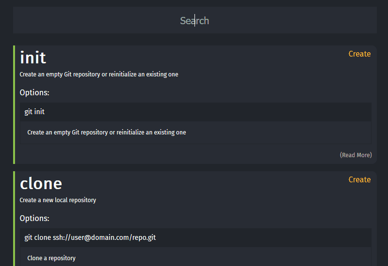

	<h1 align="center">Git Cheats - <i>Cheatsheet For Git Commands</i></h1>

    

	
	

**Git Cheats** is a small project for people who wants to get into git using commands but don't know where to start. It started as a side-project to help my friends / colleagues check commands easily, but it turned out it has been shared through my friends lots of times and it is being used on a daily basis. Suprising enough, I wanted to create a repository for this. Maybe someone finds it useful and / or wants to contribute!

### GitCheats App [(Link)](http://gitcheats.com)
A simple web-based app where you can filter out commands in need easily.

### GitCheats CLI [(Link)](https://github.com/excalith/Git-Cheats-Cli)
A CLI app as a companion to GitCheats to fetch and retrieve commands right into your beloved terminal.

## How To Contribute
Please feel free to contribute any way you can. Just keep in mind that you should pay attention to [CONTRIBUTE.md](.github/CONTRIBUTING.md) before contributing.

That being said, you can;
* Create issues for feature requests and issues
* Create pull requests for any fixes / additions
* Create pull requests for localizations

## Support
If you find this project useful, please consider <a href="https://www.buymeacoffee.com/excalith" target="_blank">supporting</a> it. This will help further domain registrations and improvements.

## Contributors
* [excalith](https://github.com/excalith) - Maintainer / English, Turkish & Klingon
* [aemmadi](https://github.com/aemmadi) - Telugu & Hindi
* [aladhims](https://github.com/aladhims) - Indonesian

## License
This project is licensed under the MIT License - see the [LICENSE.md](LICENSE.md) file for details.

___

#### Other Useful Projects
If you think there should be more, please create an issue labeled as `enhancement` and give direct link to the project.
* [Git Init](https://pel-daniel.github.io/git-init) - Great learning tool for learning how to use commands
* [Git - The Simple Guide](https://rogerdudler.github.io/git-guide) - Simple guide for getting started with git
* [Learn Git Branching](https://learngitbranching.js.org) - Learn how to use branches properly
