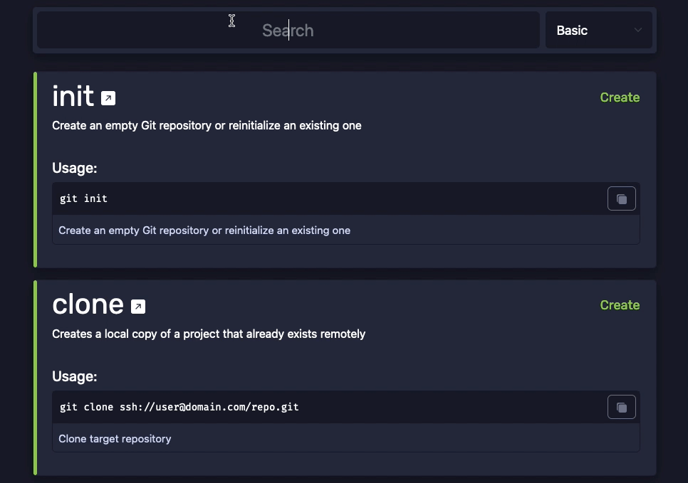

	<h1 align="center">Git Cheats • Interactive Git Cheatsheet</h1>

Git Cheats is an intuitive and user-friendly interactive Git cheatsheet that provides a handy reference for developers to search and access commonly used Git commands quickly and efficiently.

    

## Features

With Git Cheats you can;

- Easily search for commands by name
- Filter a group of commands by category
- Copy usage examples to paste into your terminal
- Click any command name to launch the original documentation
- Show and hide commands depending on their complexity through the menu (`Basic`, `Normal`, `Advanced`)
  
Also includes `strict` cookies to remember your preferences next time you launch the app. Nothing is stored on the server.

## Usage

### Online

You can find and bookmark the online version from [git-cheats.vercel.app](https://git-cheats.vercel.app)

### Local

1. Clone this repository
2. Run `yarn` to install dependencies
3. Run `yarn dev` to start server

### Docker

Planning to add this feature soon.

## Technology

- [ReactJS](https://reactjs.org/)
- [NextJS](https://nextjs.org/)
- [SWR](https://swr.vercel.app/)
- [Bootstrap](https://getbootstrap.com/)
- [Eslint](https://eslint.org/)
- [Prettier](https://prettier.io/)
- [Husky](https://typicode.github.io/husky/)
- Hosted on [Vercel](https://vercel.com/) &hearts;

For more information, please check [package.json](package.json)

## How To Contribute

Please feel free to contribute any way you can. Just keep in mind that you should pay attention to [CONTRIBUTE.md](.github/CONTRIBUTING.md) before contributing.

## License

This project is licensed under the MIT License - see the [LICENSE.md](LICENSE.md) file for details.

## Other Useful Projects

- [Git Init](https://pel-daniel.github.io/git-init) - Great learning tool for learning how to use commands
- [Git - The Simple Guide](https://rogerdudler.github.io/git-guide) - Simple guide for getting started with git
- [Learn Git Branching](https://learngitbranching.js.org) - Learn how to use branches properly
